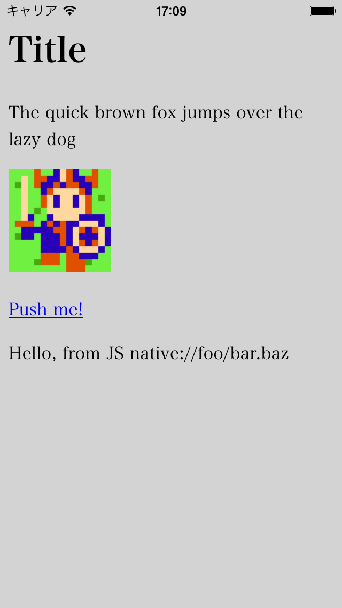

iOSでガワネイティブ
=================

ネイティブアプリなんだけどネイティブのコードは極力書かず、
WebViewを使ってhtml+JavaScriptを使ってアプリを組みたい。
今回はiOS, Swiftで作ってみる。

[コード](https://github.com/tyfkda/GawaNativeIos)

## プロジェクトの作成
Xcodeでプロジェクトを新規作成する。

* Xcodeを起動して現れるダイアログで Create a new Xcode project > iOS > Application > Single View Application を選び、Nextボタンを押す
* 「Choose options for your new project」ダイアログで Product Name などの情報を入力
    * 使用言語がObjective-CとSwiftから選べる
* プロジェクトを保存するパスを指定


## Storyboardを使わないようにする
単にWebViewを全画面に配置するだけの単純なレイアウトなのでStoryboardは必要ない。
なのでXcodeでSwiftのプロジェクトを作った時に自動的に作られるMain.storyboardを使わないようにする。

* Xcodeでプロジェクトのターゲット > General > Deployment Info > Main Interface
  を空にする。
* Main.storyboardを削除する
* ViewControllerが呼び出されなくなるので、自前で呼び出す

```swift
class AppDelegate: UIResponder, UIApplicationDelegate {
  var window: UIWindow?
  var navigationController: UINavigationController?

  func application(_ application: UIApplication, didFinishLaunchingWithOptions launchOptions: [UIApplicationLaunchOptionsKey: Any]?) -> Bool {
    window = UIWindow(frame: UIScreen.main.bounds)

    let viewController: ViewController = ViewController()
    window!.rootViewController = viewController
    window!.makeKeyAndVisible()

    return true
  }
  ...
```

## WebViewを全画面の大きさで追加
ViewControllerで全画面のWebViewを追加する。

```swift
class ViewController: UIViewController, WKNavigationDelegate {
  let webView: WKWebView = WKWebView()

  override func viewDidLoad() {
    super.viewDidLoad()

    webView.frame = view.bounds
    webView.navigationDelegate = self
    view.addSubview(webView)
  }
```

  * [WKWebView](https://developer.apple.com/reference/webkit/wkwebview)からのイベントを処理するため、[WKNavigationDelegate](https://developer.apple.com/reference/webkit/wknavigationdelegate)を継承してやる
  * `webView`の`frame`をコントローラ自体の`view.bounds`にしてやると全画面になる

## htmlの表示
htmlは外部httpサーバから取ってくることもできるが、ここではリソースとしてアプリ内部に持ち、
それをWebViewで表示することにする。

```swift
  override func viewDidLoad() {
    ...
    //let url = URL(string: "https://www.example.com/")!  // 外部のURLを読み込む場合（httpの場合Info.plistにNSAppTransportSecurityの指定が必要）
    let url = Bundle.main.url(forResource: "index", withExtension: ".html")!
    let urlRequest = URLRequest(url: url)
    webView.load(urlRequest)
  }
```

* プロジェクトにResourcesとかいうグループを作り、その中にhtmlファイルを追加する
  （ここではindex.htmlにした）
* プロジェクトの設定のBuild Phases > Copy Bundle Resourcesで追加する
  （ドラッグドロップでプロジェクトにファイルを追加した場合には自動的に登録される？ので別途行う必要はないみたい）
* [Bundle#url(forResource:withExtension)](https://developer.apple.com/reference/foundation/bundle/1411540-url)でリソースのパスを取得
* [WKWebView#load](https://developer.apple.com/reference/webkit/wkwebview/1414954-load)でWebViewに読み込む

読み込むファイルをサブディレクトリの中に入れたい場合、FinderからXcodeのResources内にサブフォルダをドラッグドロップして、Added foldersに「Create folder references」を選ぶ


## htmlから画像、JavaScript、CSSを読み込む
html内で相対パスで書けばリソース内のファイルが自動的に読み込まれる

```html
<link rel="stylesheet" type="text/css" href="main.css" />

<script type="text/javascript" src="main.js"></script>
```

## JavaScriptとネイティブの連携
### JavaScriptからネイティブを呼び出す
JavaScriptからネイティブに対してなにか起動するにはURLをリクエストして、
[WKNavigationDelegate#webView(_:decidePolicyFor:decisionHandler:)](https://developer.apple.com/reference/webkit/wknavigationdelegate/1455641-webview)が呼び出されるのを利用する。

スキーマを`http://`や`https://`じゃなくて独自のものにしておくことで判定する。
ここでは`native://`などとしてみる。

html(JavaScript)側：

```html
<p><a href="native://foo/bar.baz">Push me!</a></p>
```

ネイティブ(Swift)側：

```swift
  let kScheme = "native://";

  func webView(_ webView: WKWebView,
               decidePolicyFor navigationAction: WKNavigationAction,
               decisionHandler: @escaping (WKNavigationActionPolicy) -> Void) {
    var policy = WKNavigationActionPolicy.allow
    if let url = navigationAction.request.url?.absoluteString {
      if url.hasPrefix(kScheme) {
        evaluateJs("addTextNode('\(url) ');")
        policy = WKNavigationActionPolicy.cancel  // ページ遷移を行わないようにcancelを返す
      }
    }
    decisionHandler(policy)
  }
```

  * 呼び出されたネイティブ側では、スキーム以外のURLの残り部分を使って自由に処理すればよい

### ネイティブからJavaScriptを呼び出す
[WKWebView#evaluateJavaScript(_:completionHandler:)](https://developer.apple.com/reference/webkit/wkwebview/1415017-evaluatejavascript)を使用する：

```swift
  func evaluateJs(_ script: String) {
    webView.evaluateJavaScript(script, completionHandler: {(result: Any?, error: Error?) in
      print("JS result=\(result), error=\(error)")
    })
  }
```

  * 毎回evalすることになるし全部文字列にしないといけないのがアレだけど…
  * JavaScriptの実行結果を扱いたい場合には`completionHandler`を指定してやる（省略可能）

## 実行例

